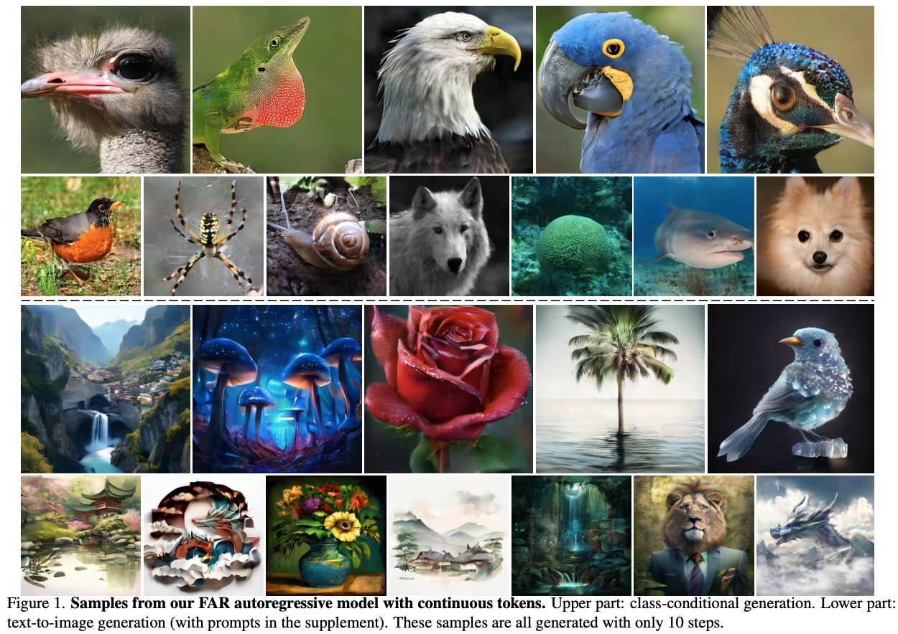
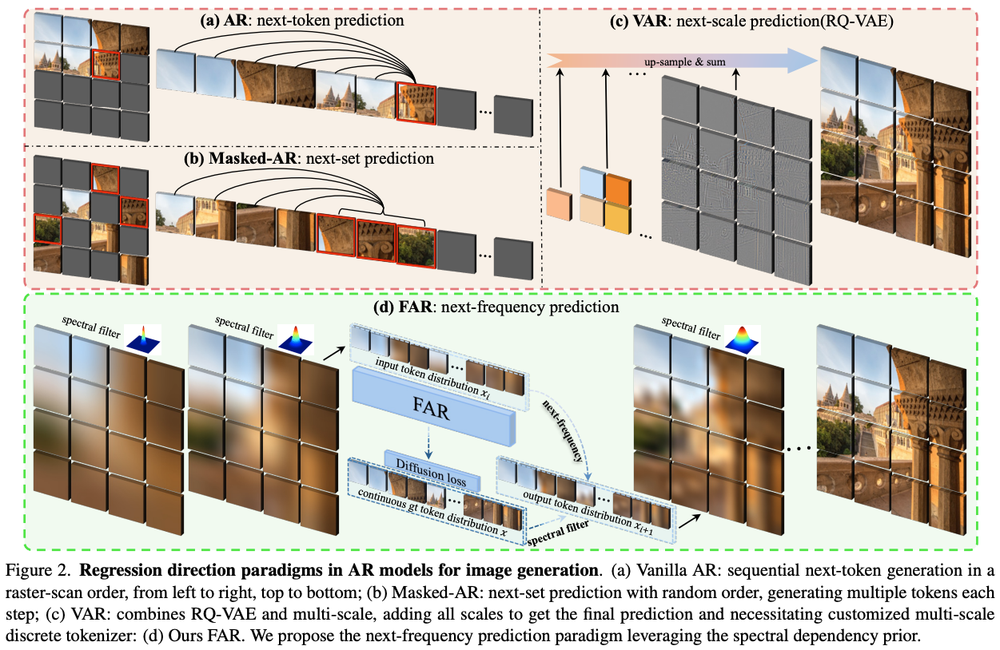

# Frequency Autoregressive Image Generation with Continuous Tokens <br><sub>Official PyTorch Implementation</sub>

[](https://arxiv.org/abs/2503.05305)&nbsp;
[](https://huggingface.co/figereatfish/FAR)&nbsp;

<p align="center">
  
</p>


## 📰 News

- [2025-3-7] We release the code and checkpoint of `FAR` for class-to-image generation on ImageNet dataset.
- [2025-3-7] The [tech report](https://arxiv.org/abs/2503.05305) of `FAR` is available.


## Preparation

### Installation

Download the code:
```
git clone https://github.com/yuhuUSTC/FAR.git
cd FAR
```

A suitable [conda](https://conda.io/) environment named `far` can be created and activated with:

```
conda env create -f environment.yaml
conda activate far
```

### Dataset
Download [ImageNet](http://image-net.org/download) dataset, and place it in your `IMAGENET_PATH`.


### Pretrained Weights
Download pre-trained [VAE](https://huggingface.co/figereatfish/FAR/tree/main/vae), and place it in `/pretrained/vae/`.

Download [.npz](https://huggingface.co/figereatfish/FAR/tree/main/fid_stats) of ImageNet 256x256 for calculating the FID metric, and place it in `/fid_stats/`.

Download the weights of [FAR_B](https://huggingface.co/figereatfish/FAR/tree/main), and place it in `/pretrained_models/far/far_base/`.

Download the weights of [FAR_L](https://huggingface.co/figereatfish/FAR/tree/main), and place it in `/pretrained_models/far/far_large/`.

Download the weights of [FAR_H](https://huggingface.co/figereatfish/FAR/tree/main), and place it in `/pretrained_models/far/far_huge/`.

Download the weights of [FAR_T2I](https://huggingface.co/figereatfish/FAR_T2I), and place it in `pretrained_models/far/far_t2i/`.

For convenience, our pre-trained MAR models can be downloaded directly here as well:

| MAR Model                                                              | FID-50K | Inception Score | #params | 
|------------------------------------------------------------------------|---------|-----------------|---------|
| [FAR-B](https://huggingface.co/figereatfish/FAR/tree/main) | 4.83    | 247.4           | 208M    |
| [FAR-L](https://huggingface.co/figereatfish/FAR/tree/main) | 3.92    | 288.9           | 451M    |
| [FAR-H](https://huggingface.co/figereatfish/FAR/tree/main) | 3.71    | 304.9           | 812M    |

### (Optional) Caching VAE Latents

Given that our data augmentation consists of simple center cropping and random flipping, 
the VAE latents can be pre-computed and saved to `CACHED_PATH` to save computations during MAR training:

```
torchrun --nproc_per_node=8 --nnodes=1 --node_rank=0 \
main_cache.py \
--img_size 256 --vae_path pretrained_models/vae/kl16.ckpt --vae_embed_dim 16 \
--batch_size 128 \
--data_path ${IMAGENET_PATH} --cached_path ${CACHED_PATH}
```


## FAR Framework
<p align="center">
  
</p>


## Training (ImageNet 256x256)
Run the following command, which contains the scripts for training various model size (FAR-B, FAR-L, FAR-H).
```
bash train.sh
```

Specifically, take the default script for FAR-L for example:
```
torchrun --nproc_per_node=8 --nnodes=4 --node_rank=${NODE_RANK} --master_addr=${MASTER_ADDR} --master_port=${MASTER_PORT} \
main_far.py \
--img_size 256 --vae_path pretrained_models/vae/kl16.ckpt --vae_embed_dim 16 --vae_stride 16 --patch_size 1 \
--model far_large --diffloss_d 3 --diffloss_w 1024 \
--epochs 400 --warmup_epochs 100 --batch_size 64 --blr 1.0e-4 --diffusion_batch_mul 4 \
--output_dir ${OUTPUT_DIR} --resume ${OUTPUT_DIR} \
--data_path ${IMAGENET_PATH}
```
- (Optional) Add `--online_eval` to evaluate FID during training (every 40 epochs).
- (Optional) To enable uneven loss weight strategy, add `--loss_weight` to the arguments. 
- (Optional) To train with cached VAE latents, add `--use_cached --cached_path ${CACHED_PATH}` to the arguments. 


## Evaluation (ImageNet 256x256)
Run the following command, which contains the scripts for the inference of various model size (FAR-B, FAR-L, FAR-H).
```
bash samle.sh
```

Specifically, take the default inference script for FAR-L for example:
```
torchrun --nnodes=1 --nproc_per_node=8  main_far.py \
--img_size 256 --vae_path pretrained/vae_mar/kl16.ckpt --vae_embed_dim 16 --vae_stride 16 --patch_size 1 \
--model far_large --diffloss_d 3 --diffloss_w 1024 \
--eval_bsz 32 --num_images 1000 \
--num_iter 10 --num_sampling_steps 100 --cfg 3.0 --cfg_schedule linear --temperature 1.0 \
--output_dir pretrained_models/far/far_large \
--resume pretrained_models/far/far_large \
--data_path ${IMAGENET_PATH} --evaluate
```
- Add `--mask` to increase the generation diversity.
- We adopt 10 autoregressive steps by default.
- Generation speed can be further increased by reducing the number of diffusion steps (e.g., `--num_sampling_steps 50`).


## Training (T2I)
Script for the default setting:
```
torchrun --nproc_per_node=8 --nnodes=4 --node_rank=${NODE_RANK} --master_addr=${MASTER_ADDR} --master_port=${MASTER_PORT} \
main_far_t2i.py \
--img_size 256 --vae_path pretrained/vae_mar/kl16.ckpt --vae_embed_dim 16 --vae_stride 16 --patch_size 1 \
--model far_t2i --diffloss_d 3 --diffloss_w 1024 \
--epochs 400 --warmup_epochs 100 --batch_size 64 --blr 1.0e-4 --diffusion_batch_mul 4 \
--output_dir ${OUTPUT_DIR} --resume ${OUTPUT_DIR} \
--text_model_path pretrained/Qwen2-VL-1.5B-Instruct  \
--data_path ${T2I_PATH}
```

- The `text encoder` employs [Qwen2-VL-1.5B](https://huggingface.co/mit-han-lab/Qwen2-VL-1.5B-Instruct/tree/main), download it and place it in your `pretrained/Qwen2-VL-1.5B-Instruct/`.
- Replace `T2I_PATH` with the path to your Text-to-image dataset path.


## Evaluation (T2I)
Script for the default setting:
```
torchrun --nnodes=1 --nproc_per_node=8  main_far_t2i.py \
--img_size 256 --vae_path pretrained/vae_mar/kl16.ckpt --vae_embed_dim 16 --vae_stride 16 --patch_size 1 \
--model far_t2i --diffloss_d 3 --diffloss_w 1024 \
--eval_bsz 32 \
--num_iter 10 --num_sampling_steps 100 --cfg 3.0 --cfg_schedule linear --temperature 1.0 \
--output_dir pretrained_models/far/far_t2i \
--resume pretrained_models/far/far_t2i \
--text_model_path pretrained/Qwen2-VL-1.5B-Instruct  \
--data_path ${T2I_PATH} --evaluate
```
- Add `--mask` to increase the generation diversity.
- We adopt 10 autoregressive steps by default.
- Generation speed can be further increased by reducing the number of diffusion steps (e.g., `--num_sampling_steps 50`).


## Acknowledgements

A large portion of codes in this repo is based on [MAE](https://github.com/facebookresearch/mae), and [MAR](https://github.com/LTH14/mar). Thanks for these great work and open source。

## Contact

If you have any questions, feel free to contact me through email (yuhu520@mail.ustc.edu.cn). Enjoy!

## Citation
```BibTeX
@article{yu2025frequency,
  author    = {Hu Yu and Hao Luo and Hangjie Yuan and Yu Rong and Feng Zhao},
  title     = {Frequency Autoregressive Image Generation with Continuous Tokens},
  journal   = {arxiv: 2406.07550},
  year      = {2025}
}
```
